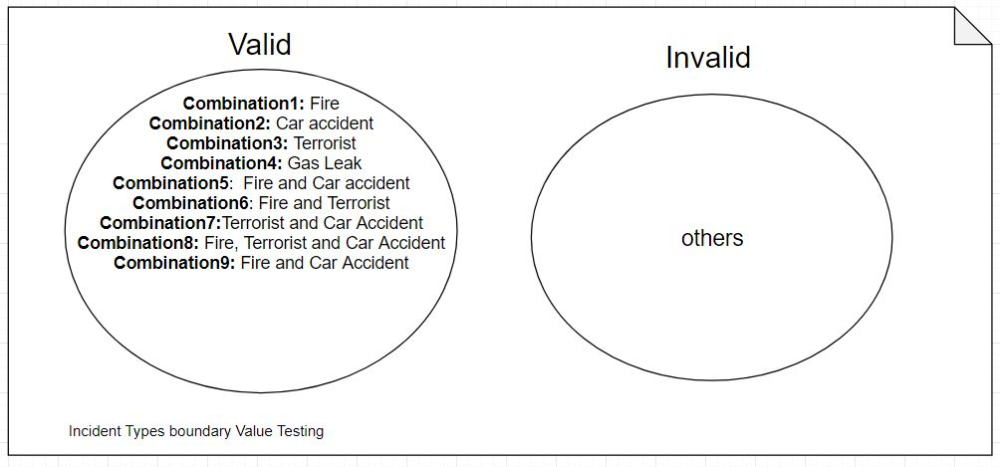

## Black box testing

!> [Click here to download](https://github.com/OkkarMin/CMSAPI.github.io/raw/master/docs/static/Test_Cases.pdf)
```pdf
https://github.com/OkkarMin/CMSAPI.github.io/raw/master/docs/static/Test_Cases.pdf
```
### Boundary Value testing for discrete values



## White box testing

### Save Incident To Firebase


### Update Map (Weather only)


