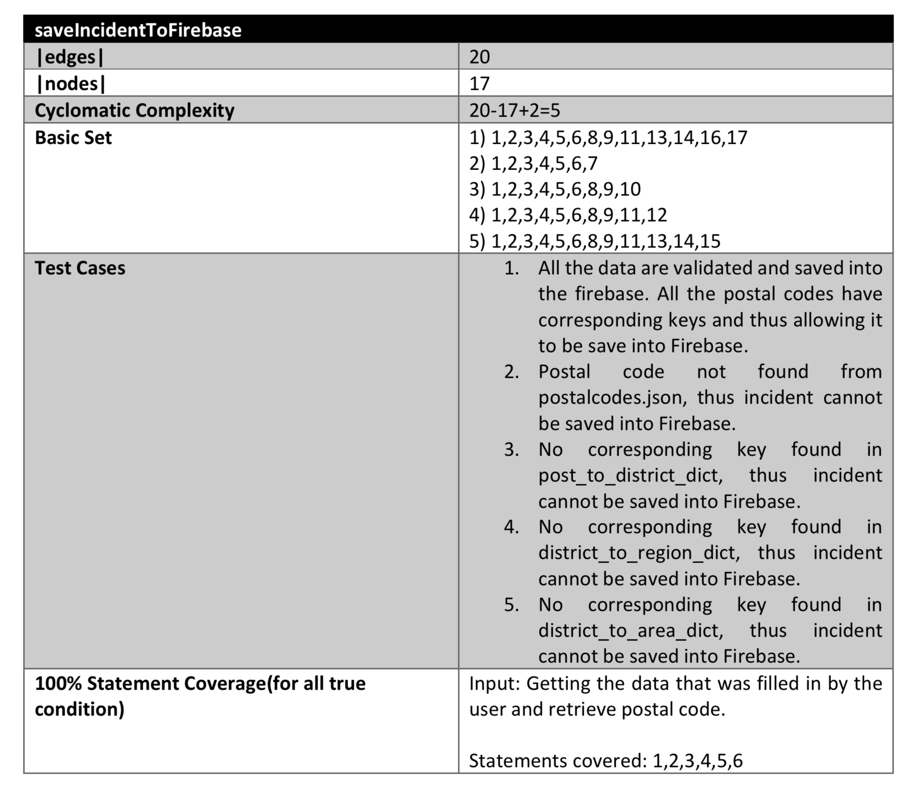
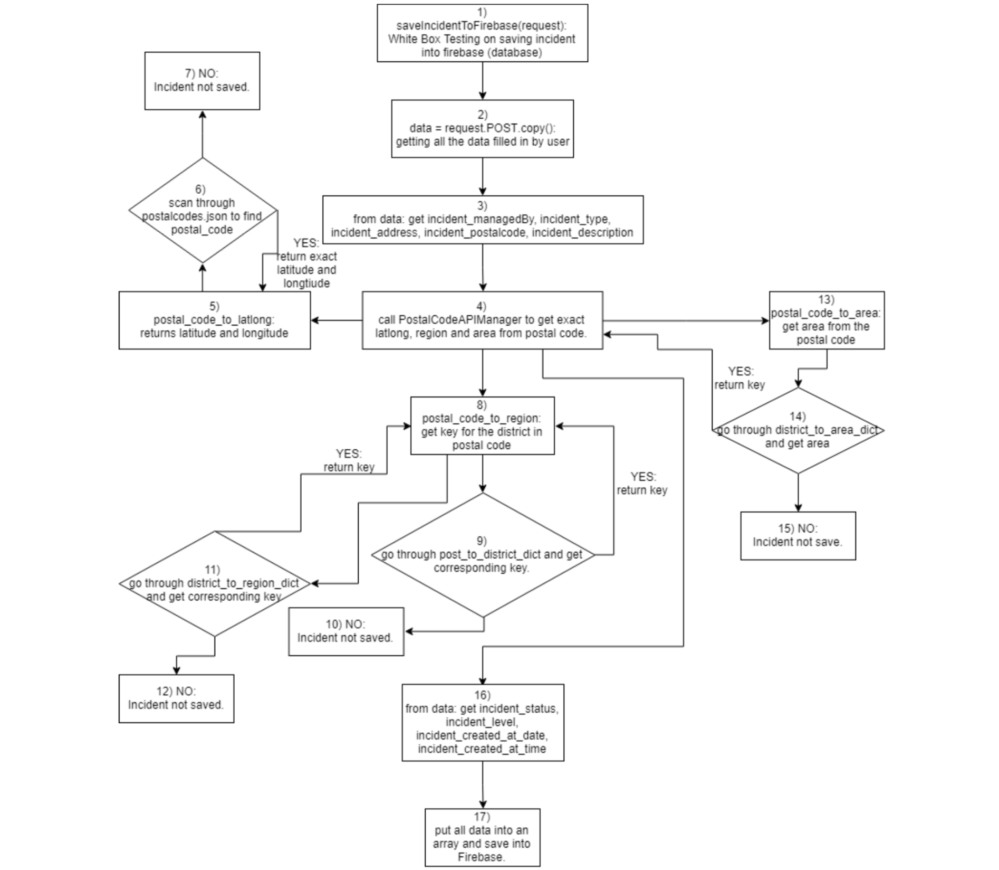
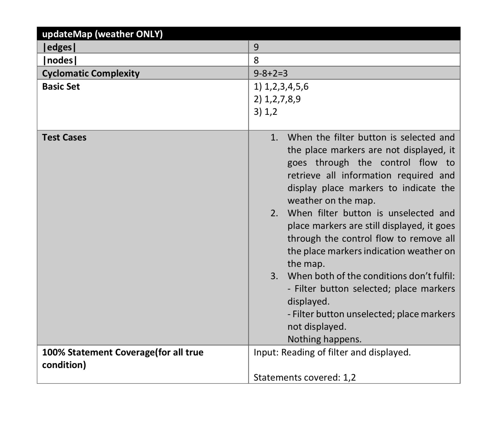
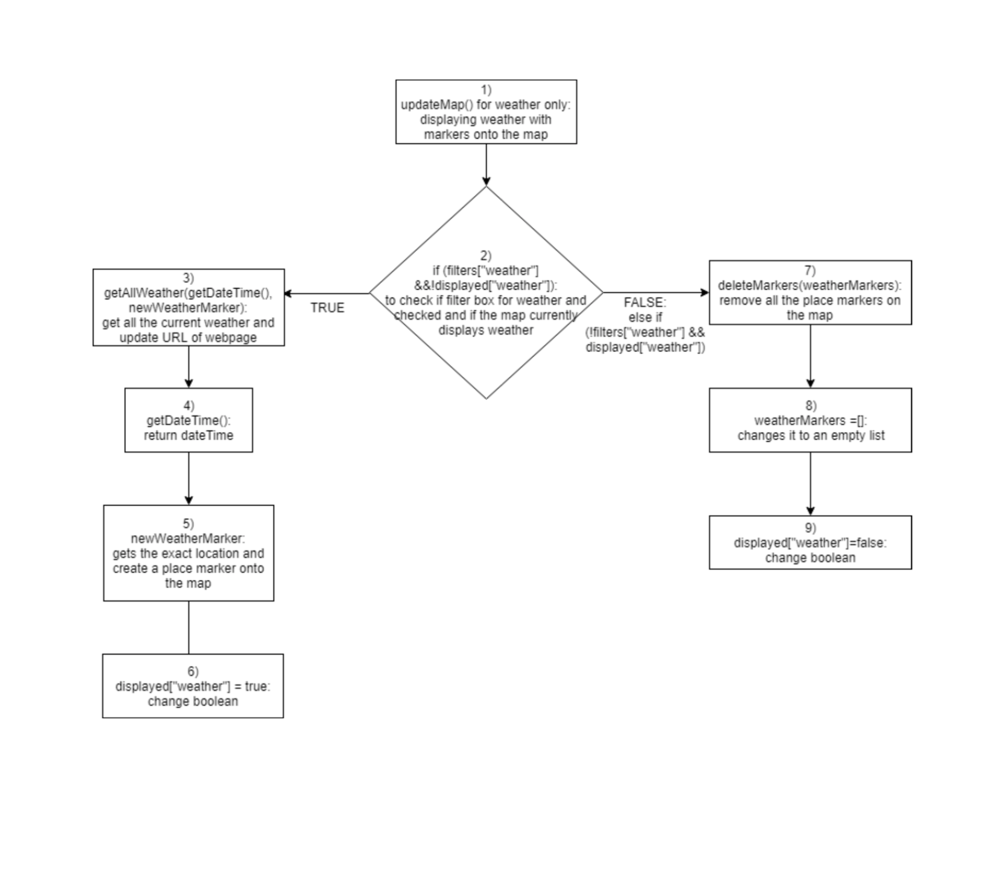

# Black box testing

```pdf
https://github.com/OkkarMin/CMSAPI.github.io/raw/master/docs/static/Test_Cases.pdf
```

# White box testing

## Save Incident To Firebase





## Update Map (Weather only)




